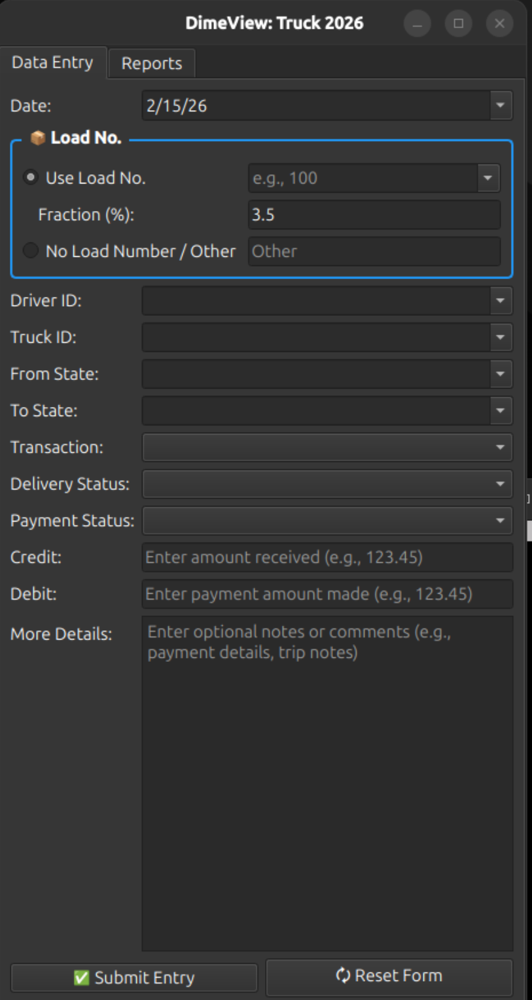
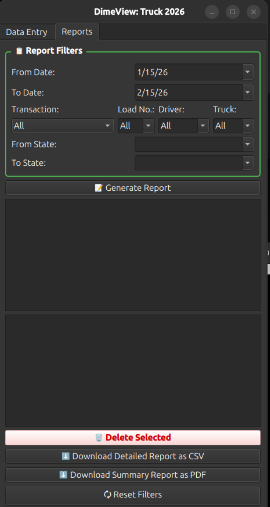
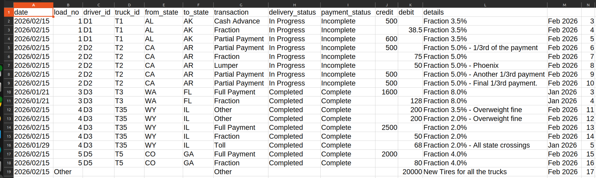
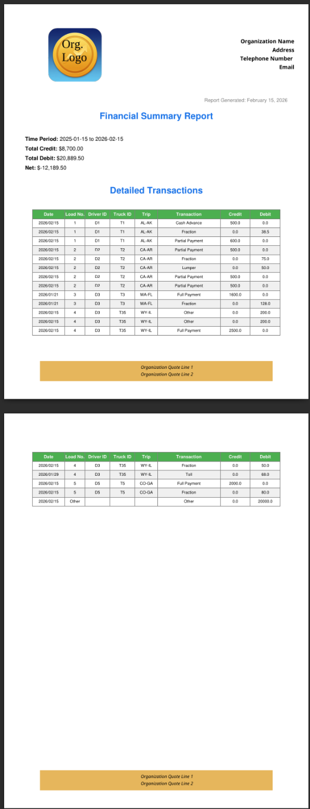

# DimeView - Simple Trucking Finance

**The straightforward tracker for Owner-Operators.**

Tracking loads, expenses, and payments shouldn't be a headache. DimeView is a desktop app designed to get the math out of your way. It manages your trucking data and keeps everything synced with your own Google Sheet.

You get the clean interface of a desktop app with the data safety of Google Drive.

**Keywords**: Trucking Software, Owner Operator Finance, Expense Tracker, Load Management, Truck Driver Accounting, Google Sheets Integration, Settlement Calculator.

---

## 📸 What it looks like (Screenshots)

### Data Entry & Dashboards

| | |
|:-------------------------:|:-------------------------:|
| **Data Entry Tab** | **Reports Dashboard** |
|  |  |

### Detailed Reports


### Generated PDF Summary


---

## 🚀 What it actually does

*   **Google Sheets Sync**: Your data lives in your Google Sheet. If your computer crashes, your data is safe.
*   **Splits Calculated Automatically**: Tired of figuring out who gets paid what? Set a percentage, and the app handles the debit/credit math for you.
*   **Reports that make sense**: See exactly how much you made on a load or over a month. [(View Sample PDF)](docs/examples/sample_report.pdf)
*   **Professional Invoices**: Generate PDFs with your own company logo and footer.
*   **"Trash" Can**: Deleted something by mistake? It just moves to a "Trash" sheet so you can recover it later.
*   **Multiple Assets**: Managing more than one truck or driver? We handle that too.
*   **CSV Export**: Need to send data to your accountant? Export everything to CSV in one click. [(View Sample CSV)](docs/examples/sample_data.csv)

---

## 🛠️ How to Install

### Option A: The Windows Installer (Easiest)

If you just want to run the app on Windows, this is the way to go.

1.  **Download and Install**: Download the `DimeView-Setup-x.x.x.exe` from the latest release and run it.
2.  **Locate the App Folder**: By default, it installs to `C:\Program Files\DimeView`.
3.  **Add your Config**:
    *   Navigate to `C:\Program Files\DimeView\config`.
    *   Paste your `DimeViewCreds.json` file here. (Don't have one? See the "Configuration" section below).
4.  **Add your Branding**:
    *   Navigate to `C:\Program Files\DimeView\resources`.
    *   Paste your company letterhead (named like `MyCompany_Letterhead.pdf`) and footer (named like `MyCompany_Footer.pdf`) here.
5.  **Run**: Just double-click `dimeview.exe` or the desktop shortcut.

> *Note: You will need Administrator permission to paste files into the Program Files folders. Just click "Continue" when Windows asks.*

---

### Option B: Running from Source (Advanced / Linux)

If you are a developer or running on Linux, follow these steps.

**Prerequisites:**
*   Python 3.12+
*   Git

**Windows (Source):**

1.  **Install Python 3.12+**: Make sure to check **"Add Python to PATH"** during installation.
2.  **Clone & Setup**:
    ```powershell
    git clone https://github.com/eashangallage/DimeView.git
    cd DimeView
    python -m venv venv
    .\venv\Scripts\activate
    pip install -e .
    ```

**Ubuntu / Linux:**

1.  **Install Dependencies**:
    ```bash
    sudo apt update
    sudo apt install -y python3 python3-pip python3-venv git \
        libxcb-xinerama0 libxcb-cursor0 libxkbcommon-x11-0 \
        libegl1 libgl1 libxcb-icccm4 libxcb-image0 libxcb-keysyms1 \
        libxcb-randr0 libxcb-render-util0 libxcb-shape0
    ```
2.  **Clone & Launch**:
    ```bash
    git clone https://github.com/eashangallage/DimeView.git
    cd DimeView
    python3 -m venv venv
    source venv/bin/activate
    pip install -e .
    
    # Run it
    dimeview
    ```

---

## ⚙️ Configuration (Required for everyone)

Before the app works, you need to give it keys to talk to Google Sheets.

### 1. Get your Google Keys
1.  Go to the [Google Cloud Console](https://console.cloud.google.com/).
2.  Make a new project (call it "DimeView" or whatever you want).
3.  Enable **Google Sheets API** and **Google Drive API**.
4.  Create a **Service Account** and download the JSON key.
5.  **Critical Step**: Rename that file to `DimeViewCreds.json`.

### 2. Connect the Sheet
1.  Open this [Google Sheet Template](https://docs.google.com/spreadsheets/d/10R0LpYzwKkCmlF6aSbygJFFXfO-GO6cAaZl4g_1cTZM/edit?gid=1473382810#gid=1473382810).
2.  Click **Share**.
3.  Open your `DimeViewCreds.json` file, find the `client_email`, and copy it.
4.  Paste that email into the Share box on Google Sheets and give it **Editor** access.

### 3. Add your Company Branding (Optional)
Want your logo on the PDF reports?
1.  Create a PDF for your letterhead (top of page).
2.  Create a PDF for your footer (bottom of page).
3.  Name them so they end in `Letterhead.pdf` and `Footer.pdf`.
    *   Example: `LionTrucking_Letterhead.pdf`
4.  Place them in the `resources` folder (see Installation area for where that is).

---

## 📝 Troubleshooting

*   **"dimeview: command not found"**: Did you activate the virtual environment (`source venv/bin/activate`)?
*   **Google API Error**: Did you put `DimeViewCreds.json` in the `config` folder? Did you share the sheet with the email inside that JSON file?
*   **PDFs look wrong**: Check your `resources` folder. The app looks for any file ending in `Letterhead.pdf` or `Footer.pdf`.

---

## License
This project is licensed under the **GPLv3 License** - see the [LICENSE](LICENSE) file for details.

Since this application uses **PyQt6**, which is licensed under GPLv3, this application must also be open-source under GPLv3. You are free to use, modify, and distribute this software, provided that any changes or derivative works are also open-sourced under the same license.
